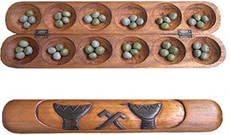

# Projet 'game_awale'

L’awalé, appelé également Awélé, Wari ou awele fait partie (à l’instar du  Mancala) des jeux de stratégie les plus anciens. Son origine serait l’ancienne Égypte.
Ces jeux sont aujourd’hui  très populaires en Afrique et symbolisent l’importance de l’agriculture.

– But du jeu : S’emparer d’un maximum de graines. Le joueur qui a le plus de graines a la fin de la partie l’emporte.
– Nombre de joueurs : 2
– Préparation : Le plateau est placé horizontalement entre les deux joueurs. Chaque joueur place 4 graines dans chacun des 6 trous devant lui.

Déroulement d’une partie d’awalé

Plateau : La partie se joue sur le plateau de 2×6 trous.

Jouer un coup : Le 1er joueur prend toutes les graines de l’un des 6 trous se trouvant de son côté et en dépose une dans chaque trou suivant celui qu’il a vidé dans le sens direct (antihoraire).

Capture : si la dernière graine est déposée dans un trou de l’adversaire comportant déjà 1 ou 2 graines, le joueur capture les 2 ou 3 graines résultantes. Les graines capturées sont alors sorties du jeu et le trou est laissé vide.
–> Rafle : Lorsqu’un joueur s’empare de 2 ou 3 graines, si la case précédente contient également 2 ou 3 graines, elles sont capturées aussi et ainsi de suite.

Boucle : Si le nombre de graines prises dans un trou de départ est supérieur à 11, cela fait que l’on va boucler un tour, auquel cas, à chaque passage, la case de départ est sautée et donc toujours laissée vide.

Affamer : Un joueur n’a pas le droit de jouer un coup qui prenne toutes les graines du camp adverse.

Fin du jeu : le jeu se termine lorsqu’un joueur n’a plus de graines dans son camp (et ne peut donc plus jouer). L’adversaire capture alors les graines restantes.
